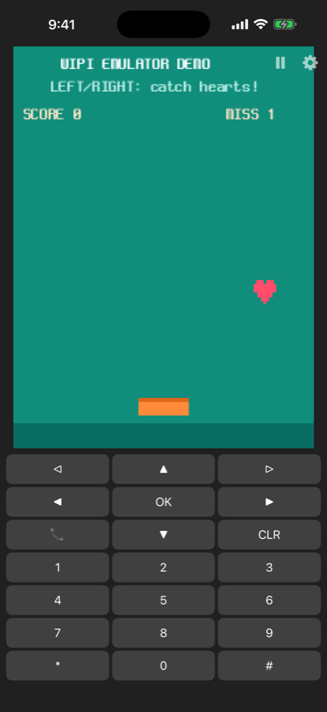
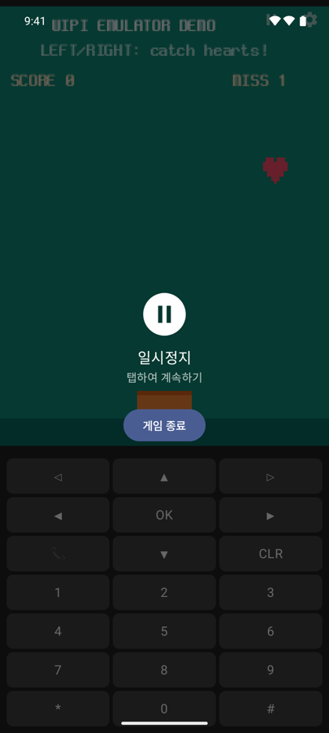
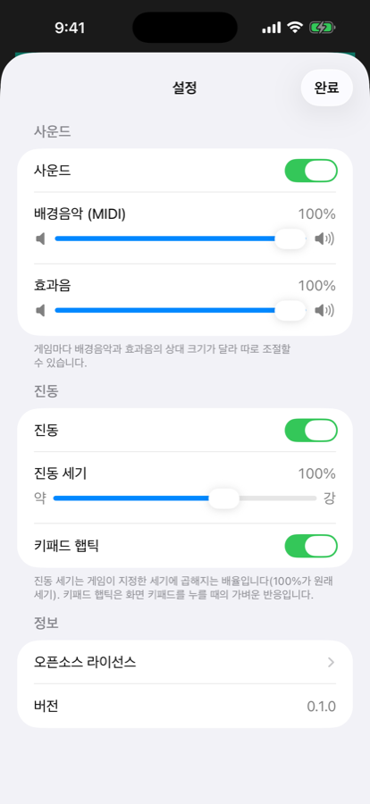

<div align="center">

# WIPI Emulator

**Play classic 2000s Korean feature-phone games (WIPI / SKVM / J2ME) on your modern device.**

[](https://play.google.com/store/apps/details?id=com.parkjeongseop.wipi)

*The iOS version is under App Store review.*

[English](#english) · [한국어](#한국어)

</div>

---

## English

A native iOS/Android emulator app for 2000s Korean feature-phone games (WIPI / SKVM / J2ME).

> **Built on [dlunch/wie](https://github.com/dlunch/wie)** — many thanks to Inseok Lee (dlunch) for the
> emulation core (wie) and the pure-Rust JVM ([RustJava](https://github.com/dlunch/RustJava)).
> This app is a porting project that consumes wie as a dependency; core improvements are contributed back upstream.

| | |
|---|---|
| Supported games | KTF (Clet) · LGT · SKT (SKVM) · J2ME packages (.zip / .jar) |
| Display | 240×320 frame polling, pixel-preserving (nearest) rendering |
| Sound | PCM (rodio/cpal) + MIDI (rustysynth + GeneralUser GS soundfont) |
| Input | Touch keypad with haptics, hardware keyboard, game controllers |
| Extras | Game library with automatic cover/title extraction, pause, vibration, separate BGM/SFX volume |

**No games are included.** You can only load game files you own.

### Download

- **Android**: [Google Play](https://play.google.com/store/apps/details?id=com.parkjeongseop.wipi)
- **iOS**: under App Store review

### Screenshots

| Library | Gameplay | Pause | Settings |
|:---:|:---:|:---:|:---:|
|  |  |  |  |
| iOS | iOS | Android | iOS |

<sub>"Heart Catch" shown on screen is our own demo game included in this repository ([demo/](demo/)).</sub>

### Structure

```
rust/            # Rust workspace
  wipi_core/     #   shared core (session · platform: screen/filesystem/DB/audio)
  wipi_android/  #   JNI bridge
  wipi_ios/      #   C ABI bridge (+ include/wipi_ios.h)
android/         # Kotlin/Compose app (Material 3)
ios/             # SwiftUI app (xcodegen)
```

The emulation core is a pure interpreter (wie + RustJava), which also works under iOS's JIT restrictions.

### License

The code in this repository is MIT licensed. Notices for bundled open-source components
(wie, RustJava, smaf — Copyright 2020 Inseok Lee, MIT / rodio, rustysynth, cpal / GeneralUser GS soundfont)
are available in the app under Settings → Open Source Licenses.

### Privacy

The app collects and transmits no personal data; game files stay on your device.
See the [Privacy Policy](docs/PRIVACY.md).

---

## 한국어

2000년대 한국 피처폰 게임(WIPI / SKVM / J2ME)을 iOS·Android에서 실행하는 네이티브 에뮬레이터 앱입니다.

> **[dlunch/wie](https://github.com/dlunch/wie) 기반** — 에뮬레이션 코어(wie)와 순수 Rust JVM
> ([RustJava](https://github.com/dlunch/RustJava))을 만드신 Inseok Lee(dlunch)님께 감사드립니다.
> 이 앱은 wie를 의존성으로 소비하는 포팅 프로젝트이며, 코어 개선은 upstream PR로 기여합니다.

| | |
|---|---|
| 지원 게임 | KTF(Clet) · LGT · SKT(SKVM) · J2ME 패키지 (.zip / .jar) |
| 화면 | 240×320 프레임 폴링, 픽셀 보존(nearest) 렌더링 |
| 사운드 | PCM(rodio/cpal) + MIDI(rustysynth + GeneralUser GS 사운드폰트) |
| 입력 | 터치 키패드(햅틱), 하드웨어 키보드, 게임패드 |
| 편의 | 게임 라이브러리(표지·이름 자동 추출), 일시정지, 진동, 배경음악·효과음 분리 볼륨 |

**게임 파일은 포함되어 있지 않습니다.** 사용자가 소유한 파일만 불러올 수 있습니다.

### 다운로드

- **Android**: [Google Play](https://play.google.com/store/apps/details?id=com.parkjeongseop.wipi)
- **iOS**: App Store 심사 중

### 스크린샷

| 라이브러리 | 게임 플레이 | 일시정지 | 설정 |
|:---:|:---:|:---:|:---:|
|  |  |  |  |
| iOS | iOS | Android | iOS |

<sub>화면 속 "하트 캐치"는 이 저장소에 포함된 자체 제작 데모 게임입니다 ([demo/](demo/)).</sub>

### 구조

```
rust/            # Rust 워크스페이스
  wipi_core/     #   공통 코어 (세션·플랫폼: 화면/파일시스템/DB/오디오)
  wipi_android/  #   JNI 브리지
  wipi_ios/      #   C ABI 브리지 (+ include/wipi_ios.h)
android/         # Kotlin/Compose 앱 (Material 3)
ios/             # SwiftUI 앱 (xcodegen)
```

에뮬레이션 코어는 iOS의 JIT 금지 환경에서도 동작하는 순수 인터프리터(wie + RustJava)입니다.

### 라이선스

이 저장소의 코드는 MIT 라이선스입니다. 포함된 오픈소스 컴포넌트(wie, RustJava, smaf — Copyright 2020 Inseok Lee,
MIT / rodio, rustysynth, cpal / GeneralUser GS 사운드폰트)의 고지는 앱 내 설정 → 오픈소스 라이선스에서 확인할 수 있습니다.

### 개인정보 처리방침

본 앱은 어떤 개인정보도 수집·전송하지 않으며, 게임 파일은 기기 로컬에만 저장됩니다.
전문은 [개인정보 처리방침 / Privacy Policy](docs/PRIVACY.md)를 참고하세요.
